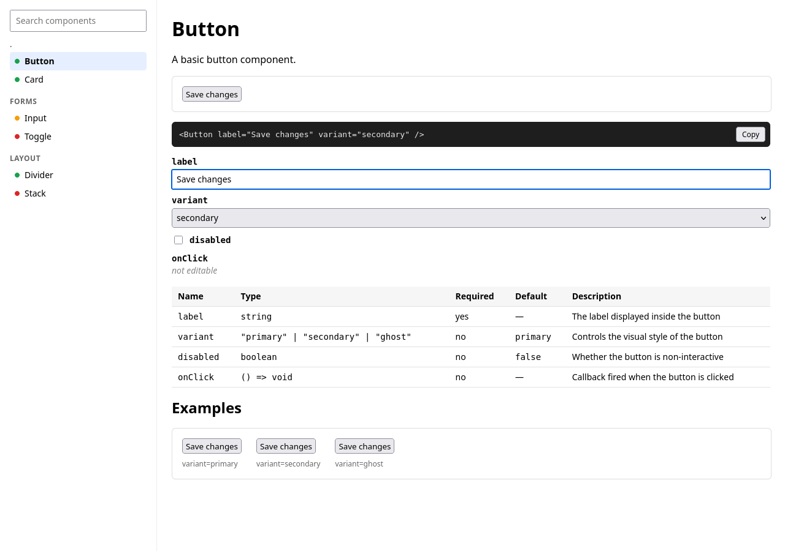
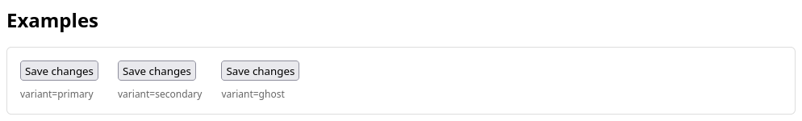

# frontdocs

Zero-config component explorer for React: Swagger for your React components.

Point it at a folder and get a browsable catalog of every component, with its props, live controls, a preview and a copyable JSX snippet. No stories, no config files.



## Quick start

Run it from inside your project:

```sh
npx frontdocs dev ./src/components
```

- `dir` defaults to `.` (the current folder).
- `--port` defaults to `3333`.

frontdocs starts a local server and prints its URL; open it in your browser.

## Features

- **Props from your types.** Extracted from TypeScript types and JSDoc comments with [react-docgen-typescript](https://github.com/styleguidist/react-docgen-typescript).
- **Prop table.** Name, type, required, default and description, with undocumented props highlighted.
- **Auto controls.** Select for literal unions (`'sm' | 'md'`), checkbox for booleans, number and text inputs.
- **Live preview.** The component renders in an iframe and updates as you change controls.
- **Examples.** Auto-generated for every combination of union props (up to 16).
- **JSX snippet.** Live code for the current props, with a copy button.
- **Sidebar.** Components grouped by folder, with search and a doc-health badge (all / some / no props documented).
- **Hot reload.** Edit a component file and the explorer updates.



## How components are found

frontdocs scans `.tsx` files under `dir` and picks up:

- exported components with PascalCase names, and
- default exports.

`node_modules` is skipped. Lowercase exports (utilities, hooks) are ignored.

## Requirements

- Node.js >= 22.12
- Run it inside a project that has `react` and `react-dom` >= 18 and `typescript` >= 5 installed. frontdocs renders with your project's own React.

## Limitations (v0.1)

- Components that need context providers (theme, router, store) won't render.
- Function, object and array props aren't editable. Callbacks log to the browser console.
- Display names for default exports come from the file name.

## Library use

The package also exports the configured parser, so you can extract the same data in your own scripts:

```ts
import parser from 'frontdocs'

const docs = parser.parse(['src/components/Button.tsx'])
```

It is react-docgen-typescript's parser with the same options the explorer uses.

## License

MIT
